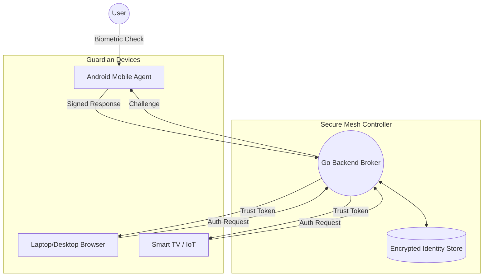

# 🛡️ Guardian Identity Agent

> **Proprietary & Confidential**  
> **Copyright © 2026. All Rights Reserved.**  
> *Unauthorized copying, distribution, or use of this project is strictly prohibited.*

The **Guardian Identity Agent** is a next-generation, multi-device authentication framework designed to replace passwords with an "invisible" identity mesh. By leveraging cross-device biometric verification and cryptographic proof-of-possession, it eliminates manual typing and phishing risks.

---

## 🏗️ System Architecture

The Guardian system operates as a distributed mesh where trust is established through a central broker and verified across authorized hardware.

---

## 🚀 Components

### 📱 Android Mobile Agent (The Guardian)
The core biometric authority of the mesh.
- **Hardware-Backed Cryptography**: Generates and stores unique device keys in the Android Keystore.
- **Biometric Integration**: Uses high-fidelity face embeddings to authorize remote requests.
- **Real-time Mesh Interaction**: Polls for pending authentication challenges from the cloud broker.

### 🌐 Chrome Extension (The Broker)
The bridge between the web and your identity.
- **Passive Detection**: Identifies authentication fields on any website without user intervention.
- **Secure Retrieval**: Communicates with the Guardian Mesh to fetch authorized credentials.
- **Encrypted Overlay**: Injects a secure UI into the page for seamless, one-click login.

### ⚙️ Go Backend (The Controller)
The high-performance coordination layer.
- **Identity Mesh Management**: Tracks authorized devices and rotates public keys securely.
- **Zero-Knowledge Simulation**: Uses encrypted facial embeddings to verify identity without exposing raw biometric data.
- **E2EE Brokerage**: Facilitates End-to-End Encrypted communication between the Mobile Agent and the Browser.

---

## 🛠️ Tech Stack

- **Backend**: Go (Golang) with AES-256 GCM, bcrypt, and ECDSA.
- **Mobile**: Kotlin (Android SDK) with Biometric Prompt API.
- **Web**: JavaScript (Manifest V3) for Chrome Extensions.
- **Data**: AES-encrypted JSON storage.

---

## 🔒 Security Model

1. **Proof of Physical Possession**: Authentication requires both a registered hardware device and a biometric match.
2. **Key Rotation**: Public keys are rotated upon every successful multi-device login, preventing replay attacks.
3. **Encrypted Biometrics**: Facial embeddings are salted and encrypted (AES-256) before storage, ensuring even the server cannot reconstruct the user's face.

---

*For inquiries or licensing, please contact the repository owner.*
